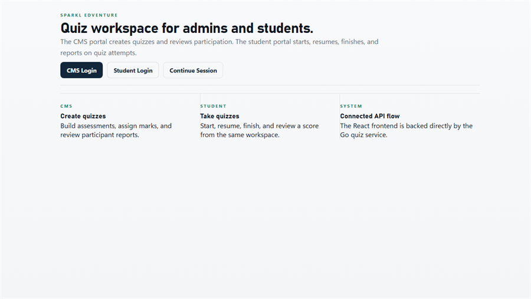
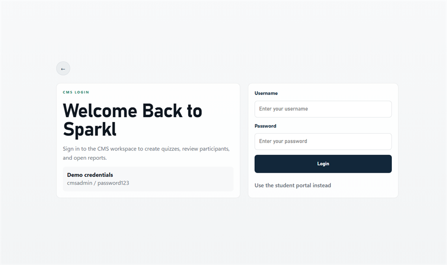
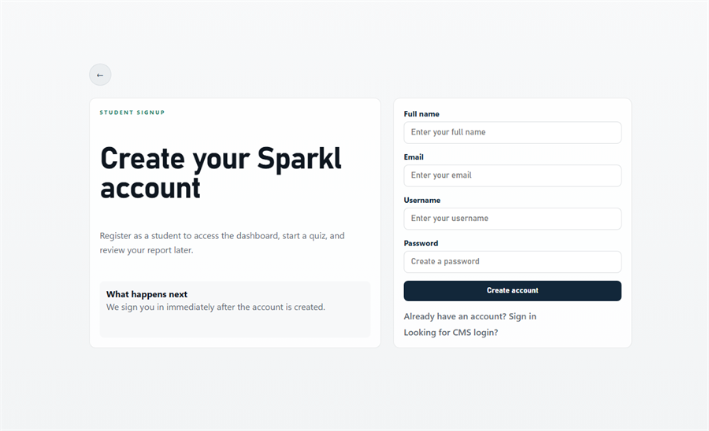

# Sparkl Assignment

Full-stack quiz platform built for the backend/full-stack assignment brief. The project includes a Go backend, a React frontend, PostgreSQL via Docker Compose, seeded demo users, and end-to-end flows for both CMS and student users.

## Assignment Coverage

This implementation covers the core assignment workflow:

- CMS login
- Student login
- CMS dashboard with quiz listing
- CMS question bank and quiz creation flow
- CMS quiz detail, participants view, and participant report
- Student dashboard with `start`, `resume`, and `view score`
- Timed student attempt flow with autosave and final submission
- Student report view after completion
- Role-based authentication and authorization
- Dockerized PostgreSQL for local setup

## Extra Improvements

These go slightly beyond the base brief, but do not conflict with it:

- Student self-signup
- Question and quiz categories with frontend filters
- App-level and route-level error boundaries in the frontend
- Race-condition protection for duplicate active attempts and duplicate answer rows

## Hosting

The assignment brief does not require hosting, so this submission is documented for local evaluation only.

## Tech Stack

- Backend: Go, Gin, GORM, PostgreSQL, JWT
- Frontend: React, TypeScript, Vite, React Router v7
- Local infrastructure: Docker Compose

## Screenshots

**Home**



**CMS Login**



**Student Signup**



## Authentication Notes

- The backend issues `HttpOnly` access and refresh cookies after successful login or student signup.
- The backend uses a short-lived access cookie plus a rotating refresh cookie.
- The frontend does not persist bearer tokens in browser storage.
- The frontend only keeps the signed-in user profile in `sessionStorage` for UI state hydration.
- Local development uses the Vite proxy so authenticated API requests stay same-origin from the browser's point of view.
- For HTTPS deployments, set `COOKIE_SECURE=true`.

## Project Structure

```text
backend/
  cmd/api/main.go
  internal/config
  internal/db
  internal/dto
  internal/handlers
  internal/middleware
  internal/models
  internal/routes
  internal/services
frontend/
  src/api
  src/auth
  src/components
  src/pages
  src/router.tsx
docker-compose.yml
README.md
```

## Prerequisites

- Go 1.25+
- Node.js 20+
- Docker Desktop

## Environment Setup

This project uses separate environment files for Docker, backend, and frontend.

### 1. Root `.env` for Docker Compose

Copy `.env.example` to `.env` in the project root:

```env
POSTGRES_USER=postgres
POSTGRES_PASSWORD=postgres
POSTGRES_DB=quizapp
```

### 2. Backend `.env`

Copy `backend/.env.example` to `backend/.env`:

```env
PORT=8080
DB_HOST=localhost
DB_PORT=5432
DB_USER=postgres
DB_PASSWORD=postgres
DB_NAME=quizapp
DB_SSLMODE=disable
JWT_SECRET=change-me
JWT_ISSUER=sparkl-edventure
ACCESS_TOKEN_TTL_MINUTES=15
REFRESH_TOKEN_TTL_DAYS=7
MAINTENANCE_INTERVAL_MINUTES=30
REVOKED_REFRESH_RETENTION_HOURS=24
FRONTEND_ORIGINS=http://localhost:5173
ACCESS_COOKIE_NAME=sparkl_access
REFRESH_COOKIE_NAME=sparkl_refresh
COOKIE_DOMAIN=
COOKIE_SECURE=false
```

Restart the backend after changing backend environment variables or database migration logic so the new configuration and schema changes are applied cleanly.

### 3. Frontend `.env`

Copy `frontend/.env.example` to `frontend/.env`:

```env
VITE_API_BASE_URL=/api/v1
```

This frontend value is intentionally relative because the Vite dev server proxies `/api/v1` to the backend running on `http://localhost:8080`.

## Running the Project

### 1. Start PostgreSQL

From the project root:

```powershell
docker compose up -d
```

### Stop or reset PostgreSQL

From the project root:

```powershell
docker compose down
```

To remove the database volume and start from a clean local state:

```powershell
docker compose down -v
```

### 2. Start the backend

From `backend`:

```powershell
go run ./cmd/api
```

Backend base URL:

- `http://localhost:8080`

### 3. Start the frontend

From `frontend`:

```powershell
npm install
npm run dev
```

Frontend base URL:

- `http://localhost:5173`

## Seeded Credentials

These users are seeded automatically on backend startup:

- CMS admin
  - username: `cmsadmin`
  - password: `password123`
- Student 1
  - username: `student1`
  - password: `password123`
- Student 2
  - username: `student2`
  - password: `password123`

Students can also create a fresh account from `/signup/student`.

## Main User Flows

### CMS Flow

1. Log in at `/login/cms`
2. Open the dashboard
3. Create or review questions in the question bank
4. Create a quiz
5. Open quiz detail
6. Review participants
7. Open a participant report

### Student Flow

1. Log in at `/login/student` or sign up at `/signup/student`
2. Open the student dashboard
3. Start a quiz
4. Move between questions while answers autosave
5. Finish the attempt
6. Open the final report

## API Summary

Base path: `/api/v1`

### Auth

- `POST /auth/cms/login`
- `POST /auth/student/login`
- `POST /auth/student/signup`
- `POST /auth/refresh`
- `POST /auth/logout`
- `GET /auth/me`

### CMS

- `GET /cms/questions`
- `POST /cms/questions`
- `GET /cms/quizzes`
- `GET /cms/quizzes/:quiz_id`
- `POST /cms/quizzes`
- `GET /cms/quizzes/:quiz_id/participants`
- `GET /cms/quizzes/:quiz_id/participants/:student_id/report`

### Student

- `GET /student/quizzes`
- `POST /student/quizzes/:quiz_id/start`
- `GET /student/attempts/:attempt_id`
- `PATCH /student/attempts/:attempt_id/answers`
- `POST /student/attempts/:attempt_id/finish`
- `GET /student/attempts/:attempt_id/report`

### Health

- `GET /health`

## Sample Payloads

### CMS login

```json
{
  "username": "cmsadmin",
  "password": "password123"
}
```

### Student signup

```json
{
  "username": "newstudent",
  "password": "password123",
  "full_name": "New Student",
  "email": "newstudent@example.com"
}
```

### Create question

```json
{
  "category": "Frontend",
  "prompt": "Which hook is used to manage state in a React function component?",
  "options": ["useState", "useFetch", "usePage", "useRouter"],
  "correct_options": ["useState"],
  "solution": "useState is React's built-in state hook for function components."
}
```

### Create quiz

```json
{
  "category": "Frontend",
  "title": "Frontend Fundamentals Quiz",
  "question_count": 3,
  "total_marks": 30,
  "duration_minutes": 15,
  "questions": [
    {
      "question_id": 1,
      "sequence_number": 1,
      "marks": 10
    },
    {
      "question_id": 2,
      "sequence_number": 2,
      "marks": 10
    },
    {
      "question_id": 3,
      "sequence_number": 3,
      "marks": 10
    }
  ]
}
```

### Save answer

```json
{
  "quiz_question_id": 1,
  "chosen_options": ["Paris"]
}
```

## Important Behavior

### Scoring

- Exact-match scoring only
- No negative marking
- Multiple correct answers are supported
- If chosen options do not exactly match the correct options, awarded marks are `0`

### Attempt Lifecycle

- A student can have at most one active `in_progress` attempt per quiz
- Completed attempts are read-only
- The backend enforces timer expiry using `started_at + duration_minutes`
- Answers are saved per `quiz_question_id` and updated in place

### Roles and Access

- `cms_admin` routes are protected
- `student` routes are protected
- JWT middleware stores `user_id` and `role` in request context
- Role middleware blocks cross-portal access

## Assumptions and Notes

- One React application serves both CMS and student portals
- PostgreSQL is expected to run locally through Docker Compose
- Docker is used only for the database; backend and frontend run locally
- Category defaults are normalized to `General` if older records have missing values
- Student signup is an extra convenience feature, not a requirement for CMS users
- Public auth routes are database-backed rate-limited and CORS is restricted to configured frontend origins
- A background maintenance loop prunes expired rate-limit rows and old refresh sessions
- This submission is intentionally not hosted because the brief does not require deployment

## Verification

### Backend

From `backend`:

```powershell
go build ./...
```

### Frontend

From `frontend`:

```powershell
npm run build
```

### Manual Smoke Test

The project has been manually exercised across these core flows:

- CMS login
- Question creation
- Quiz creation
- Student signup
- Student start/resume attempt
- Answer save
- Finish attempt
- Student report
- CMS participants
- CMS participant report
